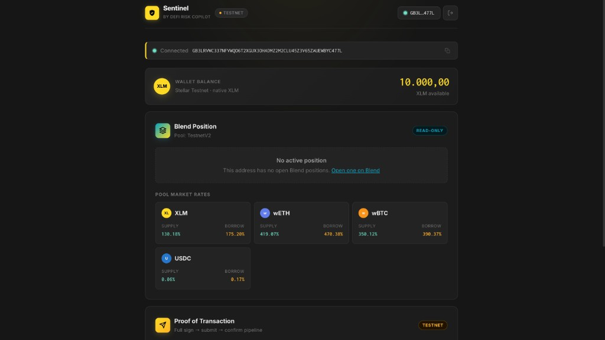
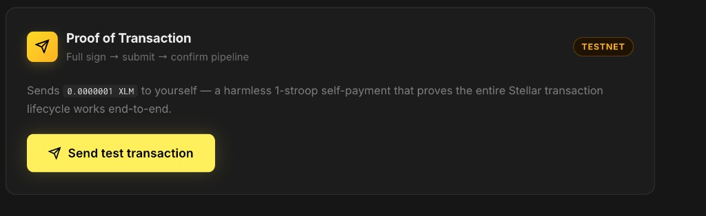
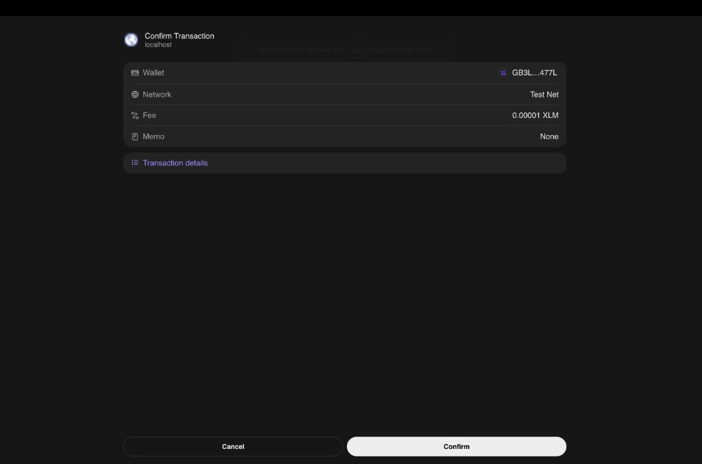
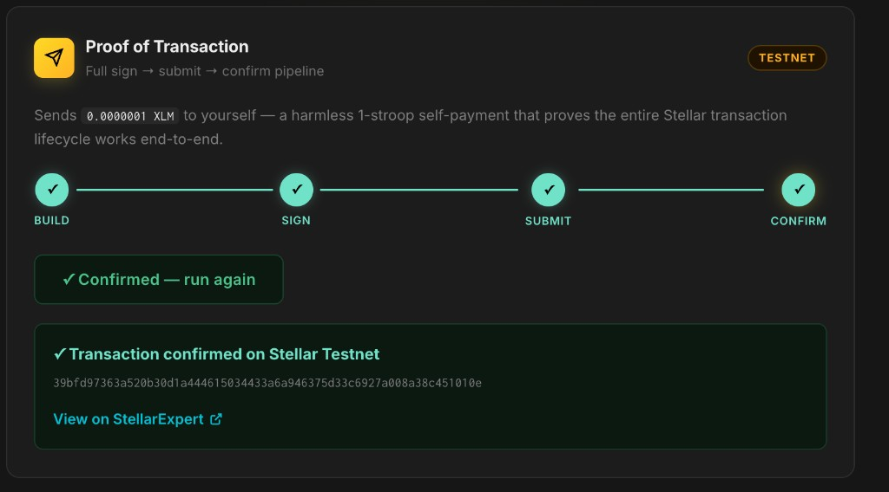

# Sentinel — DeFi Risk Copilot for Stellar

Borrowers on Blend Protocol can lose their collateral to liquidation without any warning. Sentinel fixes that.

It watches your lending positions on Blend, tells you how close you are to liquidation, and explains the risk in plain language so you actually understand what is happening and why. When you are ready for it, it can act on your behalf to protect you, but only with your explicit permission and only after a security audit. For now it reads, monitors, and explains.

This is not a yield vault. It is a risk layer for people who already have open borrow positions and want to stay informed before it is too late.

---

## What it does

**Position monitoring.** Connects to your Stellar wallet and reads your Blend lending position via Soroban RPC. Collateral, borrowed amounts, supplied assets, pool market rates, all pulled directly from the chain without any custody.

**XLM balance display.** Fetches your native XLM balance from Horizon so you always know what you are working with.

**Transaction flow.** Full sign and submit pipeline: build a transaction, send it to your wallet for signing, broadcast it to the network, and confirm it on-chain. The transaction hash and a StellarExpert link are shown once confirmed.

**AI Risk Copilot (in progress).** The plan is to pair the raw position data with an LLM and a RAG layer built on Blend's documentation and live oracle prices. Instead of showing a health factor number and leaving you to figure it out, the copilot explains it: "If XLM drops 12% from here, your position gets liquidated." That is the part that makes this different from a data dashboard.

**Alert threshold registry.** A deployed Soroban contract (`alert_registry`) stores per-user liquidation warning thresholds on-chain. Users call `set_threshold(address, threshold_bps)` — signed by their wallet — to register the health-factor level at which they want to be warned. The Sentinel backend reads these thresholds with `get_threshold` and fires alerts accordingly.

**Liquidation protection (later, opt-in only).** Once the risk engine is solid and the contracts are audited, the guardian layer will offer one-click or automated protective actions like adding collateral or partial repayment before the liquidation threshold is hit. Strictly opt-in. The default product never moves your funds.

---

## Why Blend

Blend is the largest lending protocol on Stellar, over $80M TVL as of early 2026, running on immutable Soroban contracts. Borrowers post collateral and take loans, and when their position deteriorates they get liquidated at a market premium, a direct loss. There is no friendly early-warning layer sitting on top of it today. That is the gap Sentinel fills.

---

## Tech stack

React, TypeScript, Vite on the frontend. Stellar SDK and Blend SDK for on-chain reads. Stellar Wallets Kit for multi-wallet support (Freighter, xBull, Albedo). Rust and Soroban SDK for the alert registry contract. The AI layer will be built on an LLM with retrieval-augmented generation over live position data and Blend protocol docs.

---

## How to run locally

**Requirements:** Node.js 18+, pnpm, [Freighter](https://www.freighter.app/) browser extension

```bash
git clone https://github.com/furkanyesildag/sentinel.git
cd sentinel
pnpm install
cp .env.example apps/web/.env
pnpm dev
```

Open [http://localhost:5173](http://localhost:5173) in your browser.

Open Freighter and switch the network to **Testnet**. If your account has no balance, fund it at [Stellar Laboratory Friendbot](https://laboratory.stellar.org/#account-creator?network=test).

---

## Screenshots

### Wallet connected and XLM balance displayed



### Test transaction ready to send



### Freighter signing the transaction on Testnet



### Transaction confirmed on Stellar Testnet

Build, Sign, Submit, Confirm all completed. Transaction hash and StellarExpert link shown after confirmation.



---

## Environment variables

Defaults in `.env.example` work out of the box for testnet:

```
VITE_SOROBAN_RPC_URL=https://soroban-testnet.stellar.org
VITE_HORIZON_URL=https://horizon-testnet.stellar.org
VITE_NETWORK_PASSPHRASE=Test SDF Network ; September 2015
VITE_BLEND_POOL_ID=CCEBVDYM32YNYCVNRXQKDFFPISJJCV557CDZEIRBEE4NCV4KHPQ44HGF
```
