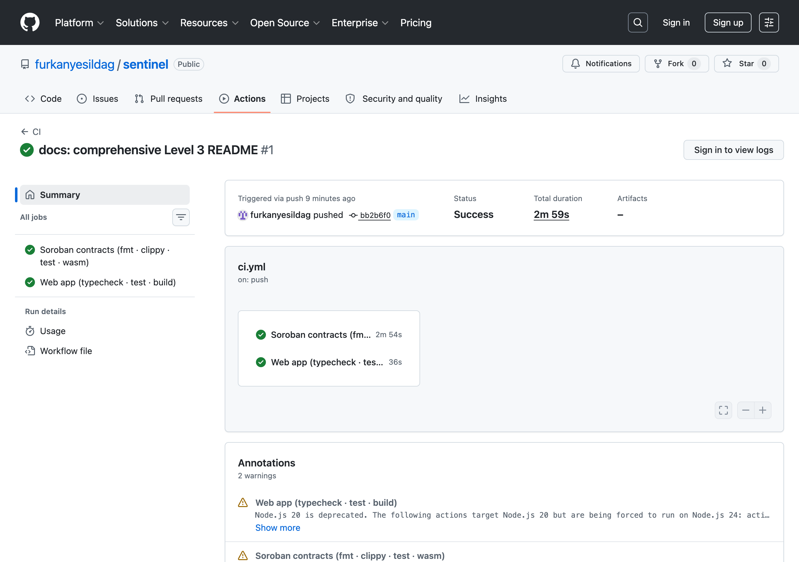
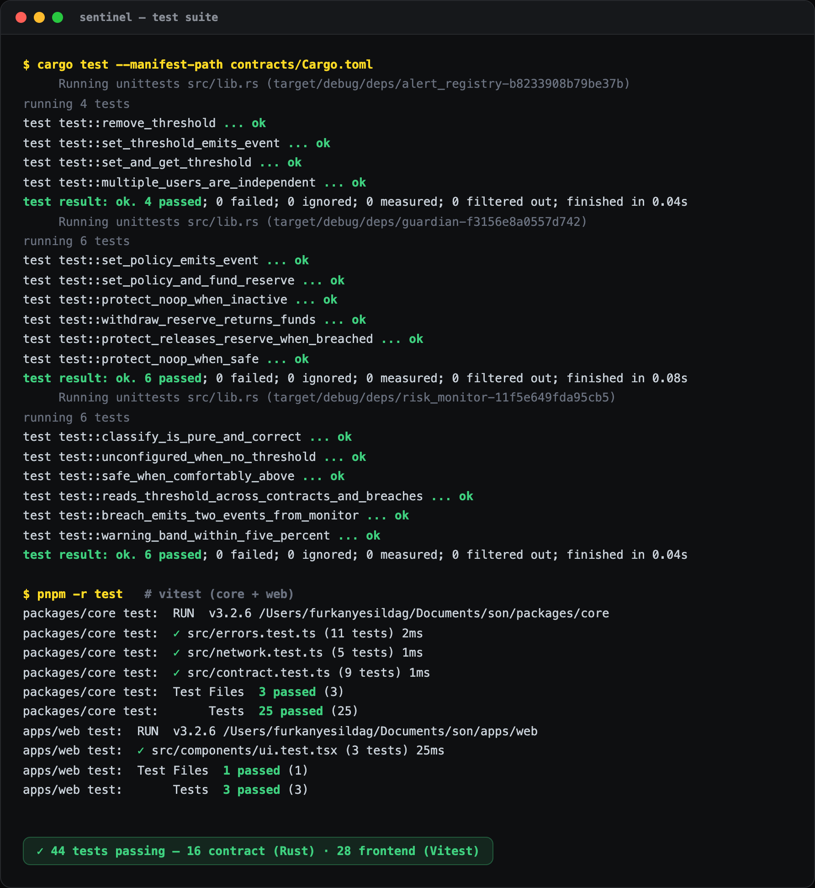
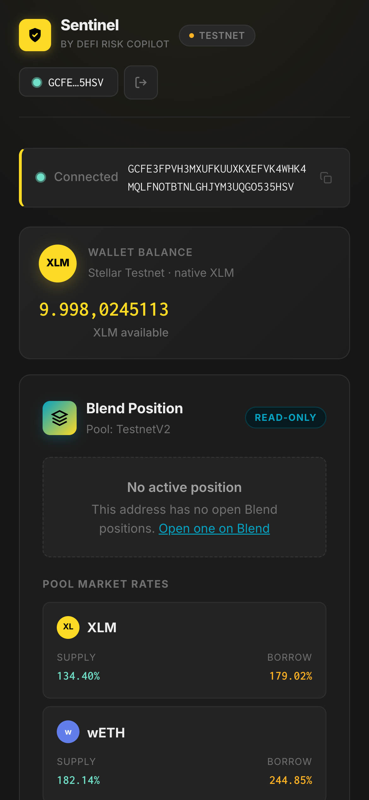
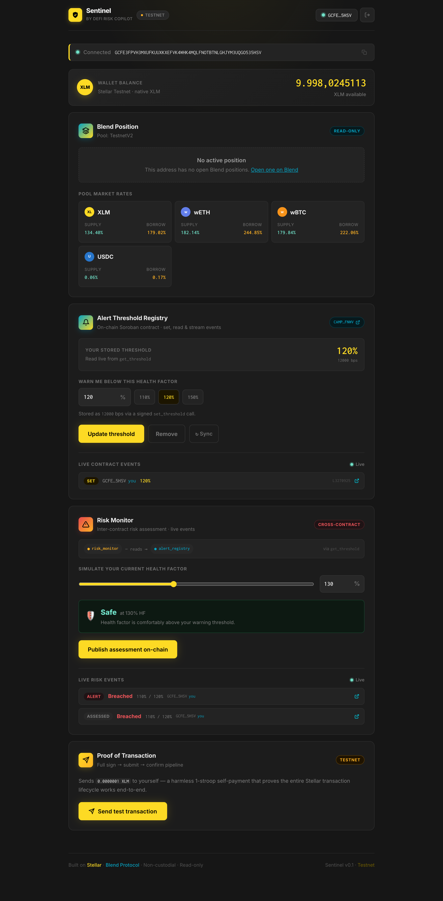
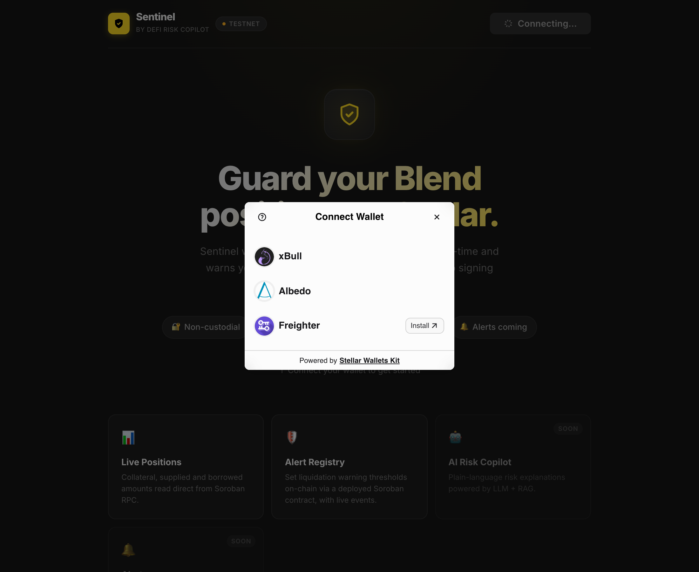

# Sentinel — DeFi Risk Copilot for Stellar

[](https://github.com/furkanyesildag/sentinel/actions/workflows/ci.yml)


Borrowers on Blend Protocol can lose their collateral to liquidation without any warning. Sentinel fixes that.

It watches your lending positions on Blend, tells you how close you are to liquidation, and explains the risk in plain language so you actually understand what is happening and why. When you are ready for it, it can act on your behalf to protect you, but only with your explicit permission and only after a security audit. For now it reads, monitors, and explains.

This is not a yield vault. It is a risk layer for people who already have open borrow positions and want to stay informed before it is too late.

- **Live demo:** **https://son-fawn.vercel.app**
- **Demo video (1–2 min):** _link to be added_

---

## Requirements checklist

### Level 3 — Advanced contracts + production-ready dApp

| Requirement | Where |
|---|---|
| Advanced smart contract | `risk_monitor` with risk classification + admin access control — [`risk_monitor/src/lib.rs`](contracts/risk_monitor/src/lib.rs) |
| **Inter-contract communication** | `risk_monitor.assess` → `alert_registry.get_threshold` via `env.invoke_contract` ([code](contracts/risk_monitor/src/lib.rs)) |
| Event streaming & real-time updates | `RiskAssessed` / `AlertTriggered` live feed — [`fetchRiskEvents`](packages/core/src/contract.ts), [`RiskMonitorPanel`](apps/web/src/components/RiskMonitorPanel.tsx) |
| CI/CD pipeline | GitHub Actions: fmt · clippy · cargo test · wasm build + pnpm test · build — [`ci.yml`](.github/workflows/ci.yml) |
| Smart-contract deployment workflow | [Deployment](#deployment) + [`contracts/deployments.json`](contracts/deployments.json) |
| Mobile responsive frontend | [mobile screenshot](docs/screenshots/06-mobile-dashboard.png) |
| Error handling & loading states | typed `classifyError` + `ErrorBanner` + `ErrorBoundary` + skeletons |
| Tests for contracts and frontend | 10 Rust + 24 Vitest = **34** ([test output](docs/screenshots/09-test-output.png)) |
| Production-ready architecture | pnpm monorepo · shared core package · config validation · error boundary |
| Documentation & demo | this README + screenshots + video |
| Contract deployment address | [`CCLHYNH4…GA5R`](https://stellar.expert/explorer/testnet/contract/CCLHYNH4GA6IDBNYHSZNKTXIVOPUIFBP3FP43UCCNRHR5RHDSLIQGA5R) |
| Tx hash for contract interaction | [`2d442bbf…cb438`](https://stellar.expert/explorer/testnet/tx/2d442bbfc26d539e039659084b95d9b39edf0efc93cb3144bb77d4cf893cb438) (cross-contract `assess`) |

<details>
<summary><b>Level 2 — multi-wallet, deployed contract, events</b></summary>

| Requirement | Where |
|---|---|
| Multi-wallet (Stellar Wallets Kit) | Freighter · xBull · Albedo — [`kit.ts`](apps/web/src/wallet/kit.ts), [screenshot](docs/screenshots/05-wallet-options.png) |
| Contract deployed on testnet | [`CAMPKYYY…PFNWV`](https://stellar.expert/explorer/testnet/contract/CAMPKYYYATXAZQDIPVDGVMPCP53A5BEQYXI3KIP3XO6S5AOUIB3PFNWV) |
| Contract called from the frontend | [`AlertRegistryPanel`](apps/web/src/components/AlertRegistryPanel.tsx) |
| Read & write contract data | [`readThreshold` / `buildSetThresholdTx`](packages/core/src/contract.ts) |
| Transaction status visible | [`TxProgress`](apps/web/src/components/TxProgress.tsx) |
| 3 error types handled | [`errors.ts`](packages/core/src/errors.ts) |
| Contract-call tx hash | [`c67251c0…727a`](https://stellar.expert/explorer/testnet/tx/c67251c00f47796851b382e2091aa306e64f80fa3e299b3b989856c6f826727a) |

</details>

---

## What it does

**Position monitoring.** Connects to your Stellar wallet and reads your Blend lending position via Soroban RPC. Collateral, borrowed amounts, supplied assets, pool market rates, all pulled directly from the chain without any custody.

**XLM balance display.** Fetches your native XLM balance from Horizon so you always know what you are working with.

**Transaction flow.** Full sign and submit pipeline: build a transaction, send it to your wallet for signing, broadcast it to the network, and confirm it on-chain. The transaction hash and a StellarExpert link are shown once confirmed.

**Alert threshold registry (live on testnet).** A deployed Soroban contract (`alert_registry`) stores per-user liquidation warning thresholds on-chain. Straight from the dashboard you can **read** your stored threshold (`get_threshold`, a free read-only simulation), **write** a new one (`set_threshold`, signed by your wallet with a live Build → Sign → Submit → Confirm tracker), and **remove** it. Every mutating call emits a typed `ThresholdSet` / `ThresholdRemoved` event that the UI streams into a live activity feed and re-reads after each write.

**Risk monitor (inter-contract).** A second deployed contract (`risk_monitor`) reads your threshold from `alert_registry` **cross-contract** and classifies your current health factor as Safe / Warning / Breached. Move the health-factor slider for a live, free, read-only assessment, or publish it on-chain to stream `RiskAssessed` / `AlertTriggered` events.

**AI Risk Copilot (in progress).** The plan is to pair the raw position data with an LLM and a RAG layer built on Blend's documentation and live oracle prices. Instead of showing a health factor number and leaving you to figure it out, the copilot explains it: "If XLM drops 12% from here, your position gets liquidated." That is the part that makes this different from a data dashboard.

**Liquidation protection (later, opt-in only).** Once the risk engine is solid and the contracts are audited, the guardian layer will offer one-click or automated protective actions like adding collateral or partial repayment before the liquidation threshold is hit. Strictly opt-in. The default product never moves your funds.

---

## Why Blend

Blend is the largest lending protocol on Stellar, over $80M TVL as of early 2026, running on immutable Soroban contracts. Borrowers post collateral and take loans, and when their position deteriorates they get liquidated at a market premium, a direct loss. There is no friendly early-warning layer sitting on top of it today. That is the gap Sentinel fills.

---

## Architecture

A pnpm monorepo with a shared TypeScript core, a React frontend, and two
Soroban contracts that talk to each other on-chain.

```
sentinel/
├── contracts/                 # Rust / Soroban workspace
│   ├── alert_registry/        # stores per-user warning thresholds + events
│   └── risk_monitor/          # reads alert_registry (inter-contract) + classifies risk
├── packages/core/             # framework-agnostic TS: RPC, contract clients, errors
├── apps/web/                  # React + Vite dashboard
└── .github/workflows/ci.yml   # CI: contracts + web
```

**On-chain data flow (inter-contract):**

```
 Browser ──assess(user, hf)──▶  risk_monitor  ──get_threshold(user)──▶  alert_registry
   ▲                               │                                        │
   │        RiskLevel  ◀───────────┘ classify(threshold, hf)                │ persistent
   └──── stream RiskAssessed / AlertTriggered events ◀── emit               └── storage
```

The frontend never holds custody or private keys: reads are RPC simulations,
writes are built locally and signed by the user's wallet.

---

## Smart contracts (Stellar Testnet)

| Contract | Address | Role |
|---|---|---|
| `alert_registry` | [`CAMPKYYYATXAZQDIPVDGVMPCP53A5BEQYXI3KIP3XO6S5AOUIB3PFNWV`](https://stellar.expert/explorer/testnet/contract/CAMPKYYYATXAZQDIPVDGVMPCP53A5BEQYXI3KIP3XO6S5AOUIB3PFNWV) | Stores per-user thresholds; emits `ThresholdSet` / `ThresholdRemoved` |
| `risk_monitor` | [`CCLHYNH4GA6IDBNYHSZNKTXIVOPUIFBP3FP43UCCNRHR5RHDSLIQGA5R`](https://stellar.expert/explorer/testnet/contract/CCLHYNH4GA6IDBNYHSZNKTXIVOPUIFBP3FP43UCCNRHR5RHDSLIQGA5R) | Reads the registry **cross-contract**, classifies risk; emits `RiskAssessed` / `AlertTriggered` |

Verifiable transactions:

| Tx | Hash |
|---|---|
| Cross-contract `assess` (risk_monitor → alert_registry) | [`2d442bbf…cb438`](https://stellar.expert/explorer/testnet/tx/2d442bbfc26d539e039659084b95d9b39edf0efc93cb3144bb77d4cf893cb438) |
| `risk_monitor` deploy | [`887be59a…89a2`](https://stellar.expert/explorer/testnet/tx/887be59aca93812b1eb54b0538ca274449b901985c275c5b3af4a877014a89a2) |
| `set_threshold` call | [`c67251c0…727a`](https://stellar.expert/explorer/testnet/tx/c67251c00f47796851b382e2091aa306e64f80fa3e299b3b989856c6f826727a) |

Full record: [`contracts/deployments.json`](contracts/deployments.json).

### Inter-contract communication

`risk_monitor.assess(user, current_hf_bps)` invokes the registry directly:

```rust
let threshold_bps: u32 =
    env.invoke_contract(&registry, &Symbol::new(&env, "get_threshold"), args);
```

It then classifies the health factor against that threshold (`Unconfigured` /
`Safe` / `Warning` within +5% / `Breached`) and publishes events. The registry
address is bound at `init` and is updatable only by the admin (`require_auth`).

### Interfaces

**alert_registry**

| Function | Auth | Event |
|---|---|---|
| `set_threshold(user, bps)` | wallet sig | `ThresholdSet` |
| `get_threshold(user) → u32` | — | — |
| `remove_threshold(user)` | wallet sig | `ThresholdRemoved` |

**risk_monitor**

| Function | Auth | Notes |
|---|---|---|
| `init(admin, registry)` | once | binds the registry + admin |
| `assess(user, hf_bps) → RiskLevel` | — | cross-contract read + emits events |
| `set_registry(registry)` | admin | re-point the bound registry |
| `get_registry() → Address` / `get_admin() → Address` | — | views |

---

## CI/CD

[GitHub Actions](.github/workflows/ci.yml) runs on every push / PR to `main`, in two parallel jobs:

- **contracts** — `cargo fmt --check`, `cargo clippy -D warnings`, `cargo test`, release `wasm32v1-none` build
- **web** — `pnpm install --frozen-lockfile`, core build, `vitest`, production `tsc + vite build`



---

## Testing

```bash
pnpm test            # frontend — Vitest (core + web)
pnpm test:contracts  # contracts — cargo test
```

- **Contracts (10):** set/get/remove + event emission for `alert_registry`; a real cross-contract integration harness + risk classification for `risk_monitor`.
- **Frontend (24):** `classifyError` across all three error kinds + heuristics, config validation, bps/percent + risk-level helpers, and `ErrorBanner` / `TxStatusPill` render tests (jsdom + Testing Library).



---

## Run locally

**Requirements:** Node.js 18+, pnpm, and [Freighter](https://www.freighter.app/) (or xBull / Albedo).

```bash
git clone https://github.com/furkanyesildag/sentinel.git
cd sentinel
pnpm install
cp .env.example apps/web/.env
pnpm dev
```

Open [http://localhost:5173](http://localhost:5173), switch your wallet to **Testnet**, and fund the account at [Friendbot](https://laboratory.stellar.org/#account-creator?network=test) if needed.

---

## Deployment

### Frontend (Vercel)

Deployed at **https://son-fawn.vercel.app**. The repo ships a
[`vercel.json`](vercel.json) configured for the pnpm monorepo (build the core
package, then the web app; output `apps/web/dist`). Deploy with:

```bash
vercel --prod        # or import the GitHub repo in the Vercel dashboard
```

No env vars are required — testnet defaults are baked in.

### Contracts (Stellar CLI)

Requires Rust 1.84+, the `wasm32v1-none` target, and the [Stellar CLI](https://developers.stellar.org/docs/tools/cli/install-cli).

```bash
rustup target add wasm32v1-none
cargo test --manifest-path contracts/Cargo.toml
stellar contract build

stellar keys generate sentinel-deployer --network testnet --fund
DEPLOYER=$(stellar keys address sentinel-deployer)

# 1) alert_registry
REGISTRY=$(stellar contract deploy \
  --wasm contracts/target/wasm32v1-none/release/alert_registry.wasm \
  --source sentinel-deployer --network testnet)

# 2) risk_monitor — bound to the registry (inter-contract)
MONITOR=$(stellar contract deploy \
  --wasm contracts/target/wasm32v1-none/release/risk_monitor.wasm \
  --source sentinel-deployer --network testnet)
stellar contract invoke --id $MONITOR --source sentinel-deployer --network testnet \
  -- init --admin $DEPLOYER --registry $REGISTRY

# 3) cross-contract call
stellar contract invoke --id $MONITOR --source sentinel-deployer --network testnet \
  -- assess --user $DEPLOYER --current_hf_bps 11000
```

Then set `VITE_ALERT_REGISTRY_ID` and `VITE_RISK_MONITOR_ID` in `apps/web/.env`
(the deployed ids are the defaults).

---

## Screenshots

### Mobile responsive & desktop

| Mobile dashboard | Desktop dashboard |
|---|---|
|  |  |

Full stacked mobile view (all panels): [`07-mobile-full.png`](docs/screenshots/07-mobile-full.png).

### Multi-wallet picker (Freighter · xBull · Albedo)



### Wallet connected and XLM balance displayed


### Test transaction ready to send


### Freighter signing the transaction on Testnet


### Transaction confirmed on Stellar Testnet

Build, Sign, Submit, Confirm all completed. Transaction hash and StellarExpert link shown after confirmation.


### CI pipeline & test output

| CI/CD passing | Test suite |
|---|---|
|  |  |

---

## Demo video

A 1–2 minute walkthrough (connect wallet → set threshold → assess risk →
cross-contract event stream): _link to be added_.

---

## Environment variables

Defaults in `.env.example` work out of the box for testnet:

```
VITE_SOROBAN_RPC_URL=https://soroban-testnet.stellar.org
VITE_HORIZON_URL=https://horizon-testnet.stellar.org
VITE_NETWORK_PASSPHRASE=Test SDF Network ; September 2015
VITE_BLEND_POOL_ID=CCEBVDYM32YNYCVNRXQKDFFPISJJCV557CDZEIRBEE4NCV4KHPQ44HGF
VITE_ALERT_REGISTRY_ID=CAMPKYYYATXAZQDIPVDGVMPCP53A5BEQYXI3KIP3XO6S5AOUIB3PFNWV
VITE_RISK_MONITOR_ID=CCLHYNH4GA6IDBNYHSZNKTXIVOPUIFBP3FP43UCCNRHR5RHDSLIQGA5R
```

---

## Tech stack

React 19 · TypeScript · Vite · Tailwind on the frontend. `@stellar/stellar-sdk`
and `@blend-capital/blend-sdk` for on-chain reads. Stellar Wallets Kit for
multi-wallet support. Rust + Soroban SDK 26 for the two contracts. Vitest +
Testing Library for frontend tests, `cargo test` for contracts, GitHub Actions
for CI. The AI Risk Copilot layer (LLM + RAG over positions and Blend docs) is
the next milestone.
